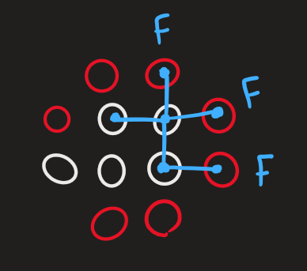
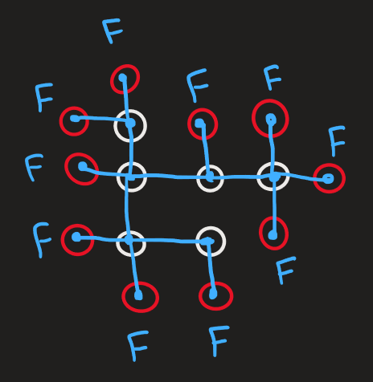

# Azeez Daoud - Prolog
Determine if a group in Go has a liberty

# Algorithm
Starting at any stone, search in all orthogonal directions:
1. If next stone is empty, Clause is True!
2. If next stone is enemy's, Clause is False!
3. If next stone is ally's, start the same search from this stone.

## Visualisation (Kinda. I'm bad at drawing)
Starting at a node

Going to adjacent nodes. Enemy makes the search False in that search tree.

Going back and continue searching. Encountering similar colour leads to continued search.

The search continues!

Fast forward... The search found an empty place! There is LIBERTY!!!

The `F`s and `T`s are now put between logical `OR`s and True means there is a an exist which in this there is!

## Example of no liberty found:

There is no way to backtrack and continue searching into unvisited nodes. All searches ended in false. Thus logical `OR`s results in false as well which means, group is NOT alive.